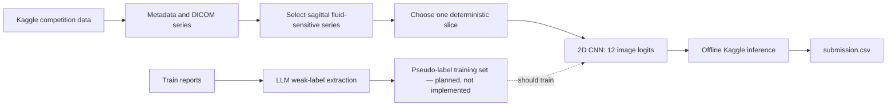

# Project Inspection Report — RSNA Knee Abnormality Detection

**Inspection date:** 2026-08-10  
**Scope:** source code, configuration, documentation, local sample metadata,
saved output artifacts, and Git state. No training or external API calls were
started during this inspection.

## 1. Executive summary

This repository is an early-stage Kaggle competition project for predicting 12
knee-MRI abnormalities. Its central insight is sound: only **58 of 4,407**
training studies have gold structured labels, while every training study has a
free-text radiology report. Therefore, the 58-row image model is deliberately a
pipeline test; the intended route to a useful model is to turn the other 4,349
reports into weak labels and then train an **image-only** model. Test data has
no report text, so text cannot be an inference-time input.

The Step-1 image pipeline has run successfully on Kaggle: it trained, wrote
checkpoints, and created a correctly shaped, non-constant submission. The weak
label extractor has also been exercised on all 58 gold reports and on a 300-row
unlabeled smoke-test subset. However, **Step 2 is not yet an end-to-end
training pipeline**: there is no code that combines gold and weak labels,
trains on that enlarged data set, publishes weights, or runs the required
offline final-inference kernel.

In short: the repository has a verified plumbing baseline and a promising
label-extraction prototype, but not yet a competition-ready final system.

## 2. Problem and data

The project targets the Kaggle competition
[`rsna-knee-abnormality-detection`](https://www.kaggle.com/competitions/rsna-knee-abnormality-detection).
The stated metric is macro AUC-ROC over 12 independent binary targets:

`ACL`, `MCL`, `Medial Meniscus`, `Lateral Meniscus`, `Medial OA`, `Lateral OA`,
`PF OA`, `Effusion`, `Synovitis`, `Baker's`, `Contusion`, and `Fracture`.

The local metadata copy confirms the following schema and scale:

| File | Shape / contents | Role |
| --- | --- | --- |
| `data/train.csv` | 4,407 rows × 14 columns | Study UID, report text, 12 sparse target columns |
| `data/train_series.csv` | 24,371 rows × 5 columns | Study-to-series mapping and series metadata |
| `data/test.csv` | 3 rows × 1 column | Public test-study UIDs only; no `Report` field |
| `data/test_series.csv` | 15 rows × 5 columns | Metadata for the three public test studies |
| `data/sample_submission.csv` | 3 rows × 13 columns | Required submission schema |
| `data/processed/weak_labels.csv` | 300 rows × 15 columns | Current weak-label smoke-test output, not the full set |

All 12 targets are non-null for exactly **58 / 4,407 (1.3%)** training rows.
The remaining 4,349 are report-only rows. The 58 gold-row positive rates range
from 15.5% for MCL to 60.3% for Effusion; these values are too unstable to be a
useful benchmark by themselves.

`train_series.csv` contains 9,864 sagittal, 8,609 coronal, and 5,898 axial
series. The project’s local image sample is intentionally tiny. I verified
that the downloaded train study has five usable series and that a chosen DICOM
decodes as a 640 × 640 float32 image with pixel values 0–946. It is suitable
for code-path smoke tests, not model evaluation.

## 3. Intended system flow

The text branch is intentionally limited to producing labels during training;
it is not used to make test predictions because `test.csv` has no reports.

## 4. Repository guide

| Location | What it contains | Current state |
| --- | --- | --- |
| `README.md` | Setup, data-download guidance, Kaggle workflow | Useful overview, but parts conflict with the newer baseline plan. |
| `CLAUDE.md` | Operating rules: no full local download, frequent checkpoints, offline final inference | Important policy document; some rules are not fully implemented. |
| `configs/config.yaml` | Competition names, paths, target order and baseline settings | Used by the trivial-submission script; model scripts mostly hard-code their own defaults. |
| `docs/baseline_plan.md` | Rationale and two-stage modeling plan | Best statement of intended strategy. |
| `notebooks/01_data_exploration.py` | Cell-based data/schema/DICOM/report exploration script | Read-only and useful for local sample inspection. |
| `scripts/survey_competition_files.py` | Paginates Kaggle file listing without downloading data | Supports safe sample selection. |
| `scripts/download_sample.py` | Downloads root CSVs plus a fixed, small DICOM sample | Idempotent; avoids the ~570 GB full download. |
| `src/preprocessing/dicom_utils.py` | Series selection, DICOM reading, normalization | Implemented and locally smoke-tested. |
| `src/data/dataset.py` | `KneeSliceDataset` for one image and 12 labels per study | Implemented and locally smoke-tested. |
| `src/models/image_baseline.py` | ResNet-18 / EfficientNet-B0 backbone plus 12-logit head | Implemented and locally smoke-tested. |
| `src/training/train_baseline.py` | Step-1 58-row training loop and checkpoints | Ran on Kaggle; needs reproducibility and resume improvements. |
| `src/inference/make_trivial_submission.py` | Valid constant/base-rate submission | Implemented and verified by saved output. |
| `src/inference/predict.py` | Loads a checkpoint and writes model probabilities | Implemented and used in the v0 Kaggle run. |
| `src/weak_labeling/llm_extract.py` | Structured LLM extraction of 12 report findings | Present but currently untracked in Git. |
| `scripts/weak_label_reports.py` | Checkpointed validation/full weak-label batch runner | Present but currently untracked in Git. |
| `kernels/dev/` | Full-data schema/smoke-test Kaggle kernel | CPU, internet enabled; not a scored submission kernel. |
| `kernels/train_v0/` | Trains v0 then makes predictions on Kaggle | Has completed a run, but metadata currently disables GPU and enables internet. |
| `outputs/` | Pulled Kaggle results, local submissions, weak-label artifacts | Regenerable output; most CSVs are intentionally ignored by Git. |

## 5. How the implemented image baseline works

### DICOM preprocessing

`select_series()` first chooses a **Sagittal + Fluid_Sensitive** series,
then any sagittal series, then the first series available. This is a sensible
v0 heuristic for ligaments, menisci, cartilage, and effusion.

`pick_middle_slice()` sorts DICOM filenames and chooses the middle one.
This is deterministic but is **not anatomically the middle MRI slice** because
the filenames are SOP instance UIDs rather than slice positions. The source
documents this limitation. `load_slice_array()` reads pixels through `pydicom`
and applies `RescaleSlope` and `RescaleIntercept`. Each slice is min–max scaled
to uint8, resized from 640 × 640 to 224 × 224, replicated from one channel to
three channels, and normalized with ImageNet mean/std values.

### Dataset and model

`KneeSliceDataset` provides one tensor of shape `(3, 224, 224)` and a vector
of 12 float labels for each study. Missing series data is a hard error, which
is helpful while verifying a small plumbing run.

`KneeImageBaseline` uses a pretrained-or-random ResNet-18 by default (with an
EfficientNet-B0 option) and replaces the classifier with a 12-output linear
head. The output is raw logits, correctly paired with `BCEWithLogitsLoss`.
I loaded a real local DICOM through this dataset and completed a no-grad model
forward pass: the image and all 12 output logits were finite and had the
expected shapes.

### Training and inference

`train_baseline.py` filters to rows with all 12 gold labels, randomly splits
them into train/validation partitions, trains with AdamW and unweighted binary
cross-entropy, writes a CSV log, and saves `epoch_N.pt`, `last.pt`, and
`best.pt`. A custom metric excludes targets whose validation split contains
only one class, which is necessary with this tiny sample.

`predict.py` restores the saved model, injects unused dummy labels so it can
reuse `KneeSliceDataset`, predicts the test rows, matches the exact sample
submission column order, and asserts row count, columns, and absence of NaNs.

`make_trivial_submission.py` provides the safety-net submission: it uses the
available gold-label prevalence per target (or 0.5 if labels are unavailable)
and performs the same schema checks.

## 6. Existing run results

The saved `train_v0` Kaggle log contains eight epochs. Its best validation
macro AUC was **0.5681 at epoch 4**, over 10 targets with defined AUC. Training
loss fell from 0.6881 to 0.0956 while validation loss rose overall; that is
expected overfitting on such a small split. It must not be interpreted as a
reliable model-quality measurement.

Both the trivial and v0 submissions have the required 3 × 13 schema, no NaNs,
and values in `[0, 1]`. The trivial file has one repeated prediction row. The
v0 model file has three distinct prediction rows, showing that the end-to-end
model path produced input-dependent probabilities.

## 7. Weak-labeling subsystem

The weak-labeling code sends batches of reports to a locally authenticated
Claude Code CLI process and requires schema-valid JSON. It maps target names
such as `Medial Meniscus` and `Baker's` to JSON-safe keys, then maps them back.
The prompt explicitly handles multilingual reports, negation, the competition
severity convention, and incomplete reports. The batch runner supports a
checkpoint CSV, retries each LLM call up to three times, and can process
batches concurrently.

It was validated against the 58 gold reports without supplying their labels to
the extractor. The mean per-target agreement was **84.6%**:

| Target | Agreement | Precision | Recall |
| --- | ---: | ---: | ---: |
| ACL | 94.8% | 88.9% | 100.0% |
| MCL | 96.6% | 81.8% | 100.0% |
| Medial Meniscus | 87.9% | 85.2% | 88.5% |
| Lateral Meniscus | 77.6% | 75.0% | 65.2% |
| Medial OA | 86.2% | 68.4% | 86.7% |
| Lateral OA | 84.5% | 57.1% | 72.7% |
| PF OA | 91.4% | 100.0% | 76.2% |
| Effusion | 75.9% | 86.2% | 71.4% |
| Synovitis | 69.0% | 76.5% | 48.1% |
| Baker's | 89.7% | 68.8% | 91.7% |
| Contusion | 75.9% | 60.9% | 73.7% |
| Fracture | 86.2% | 77.8% | 77.8% |

These figures are encouraging but are based on only 58 studies and are not a
replacement for a held-out evaluation. In particular, Synovitis, Contusion,
Effusion, and Lateral Meniscus need extra quality control before their
pseudo-labels are trusted equally.

The current `data/processed/weak_labels.csv` has **300** report-only studies:
295 rows have all 12 predicted labels and 298 have at least one. It is a
partial smoke-test product, not the complete 4,349-row weak-label set.

## 8. Important gaps and risks

1. **Step 2 is disconnected.** The repository creates weak labels but has no
   dataset/training code that reads `weak_labels.csv`, merges it with the 58
   gold rows, handles null or low-confidence targets, or trains a new model.
   This is the highest-priority missing feature.
2. **No final offline inference kernel exists.** The only model kernel trains
   and infers in one internet-enabled run. The final requirement is a distinct
   `enable_internet=false` Kaggle artifact that only loads published weights,
   predicts, and writes `submission.csv`.
3. **The v0 kernel is CPU-configured.**
   `kernels/train_v0/kernel-metadata.json` says `enable_gpu: false`, although
   the plan describes GPU training. This is harmless for 58 rows but should be
   corrected before full weak-label training.
4. **Checkpointing is not true resumption.** The training script saves every
   epoch but has no `--resume` option and does not restore a model, optimizer,
   epoch, or random state. A restarted run overwrites the stable checkpoint
   names, so it does not yet meet the stated resumability rule.
5. **Configuration is not the single source of truth.** `config.yaml` says
   3 epochs and batch size 32; the script defaults to 5/8; the Kaggle driver
   uses 8/8. Target names and paths are duplicated across multiple files.
   Most training/inference settings do not read the YAML file.
6. **Documentation is inconsistent.** README workflow step 4 still calls for
   multimodal image+text modeling after v0. The newer baseline plan correctly
   prioritizes weak labels and says inference must remain image-only. The plan
   suggests keyword/rule extraction, while the implemented code uses an LLM.
7. **Weak-label portability/recovery needs hardening.** The extractor embeds
   one user-specific Windows path to `claude.exe`; it will fail elsewhere.
   It does not verify that every requested report ID appears exactly once in a
   response. A malformed-but-successful response becomes null labels and is
   considered complete on resume; if every first batch fails, reading the
   expected checkpoint CSV would also fail.
8. **The one-slice v0 representation is intentionally weak.** Filename order
   is not slice order, there is no augmentation, class weighting, mixed
   precision, true positional sorting, multi-slice aggregation, or
   multi-series pooling. These are reasonable later improvements, but not
   current capabilities.
9. **Reproducibility is incomplete.** There is a split seed, but NumPy,
   PyTorch, CUDA, and DataLoader randomness are not seeded; dependency versions
   in `requirements.txt` are unpinned; there are no automated tests or CI.
10. **The README’s Python warning is stale locally.** It says Python 3.14 is
    too new for stable Torch wheels. This workstation currently imports
    Python 3.14 packages successfully, including Torch 2.11.0+cu128 and
    torchvision 0.26.0+cu128. Kaggle remains the right place for full data,
    but the local environment note should be updated.
11. **Uncommitted work is material.** `src/weak_labeling/`,
    `scripts/weak_label_reports.py`, and weak-label output directories are
    currently untracked. A clone of the current branch would not contain the
    newly implemented Step-2 extraction code.

## 9. Recommended completion order

1. Add and review the currently untracked weak-labeling source files in Git.
2. Make the YAML configuration authoritative, add global seeding, and implement
   robust checkpoint resumption with run-specific directories.
3. Build a weak-label training dataset: preserve gold labels, define a policy
   for null/low-confidence pseudo-labels, and evaluate against a fixed gold
   validation fold.
4. Enable a GPU in the full-training kernel and run the first weakly supervised
   image model. Compare it with v0 only as a plumbing/ablation check.
5. Publish the selected weights as a Kaggle Dataset or kernel output and create
   a separate, internet-disabled inference kernel. Test its submission before
   entering it.
6. Only after that baseline is stable, improve image evidence using anatomical
   slice ordering and multi-slice/multi-series aggregation; then consider
   stronger backbones, folds, ensembling, or test-time augmentation.

## 10. Verification performed

- `python -m compileall -q src scripts notebooks kernels` completed with no
  syntax errors.
- All declared project packages imported successfully in the local Python
  environment.
- A real DICOM file decoded and normalized correctly through project code.
- `KneeSliceDataset` emitted a finite `(3, 224, 224)` tensor and the image
  model emitted finite `(1, 12)` logits.
- Saved trivial, v0, dev-kernel, and train-kernel submission files all have
  valid schema and prediction bounds.
- No source files were changed by this inspection; this report is the only new
  tracked-document candidate.
